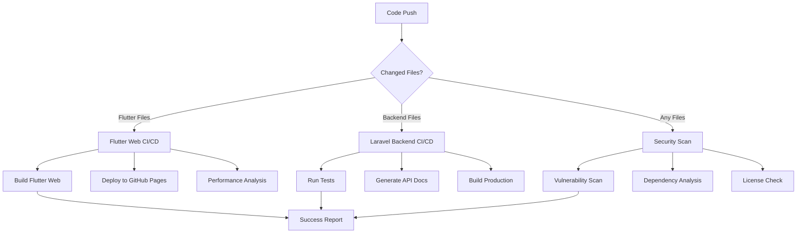

# 🚀 Complete CI/CD Pipeline Documentation
# Comprehensive GitHub Actions workflows for Doctor Call Application

## 📋 Overview

This repository contains a complete CI/CD pipeline consisting of three main workflows:

### 1. 🌐 Flutter Web CI/CD (`flutter-web-ci.yml`)
- **Purpose:** Build and deploy Flutter web application
- **Triggers:** Push to master/main, Pull requests, Manual dispatch
- **Outputs:** GitHub Pages deployment, Performance reports

### 2. 🏥 Laravel Backend CI/CD (`laravel-ci.yml`)
- **Purpose:** Test, build, and validate Laravel API backend
- **Triggers:** Backend file changes, Pull requests, Manual dispatch
- **Outputs:** Test reports, API documentation, Production builds

### 3. 🔒 Security & Dependencies (`security.yml`)
- **Purpose:** Security scanning and dependency monitoring
- **Triggers:** Code changes, Weekly schedule, Manual dispatch
- **Outputs:** Security reports, License analysis, Vulnerability alerts

## 🏗️ Workflow Architecture



## 🛠️ Technology Stack

### Frontend (Flutter)
- **Flutter Version:** 3.24.3
- **Platform:** Web
- **Build Tool:** Flutter CLI
- **Deployment:** GitHub Pages
- **Testing:** Flutter test framework

### Backend (Laravel)
- **PHP Version:** 8.2
- **Framework:** Laravel 10.x
- **Database:** MySQL 8.0
- **Cache:** Redis 7
- **Testing:** PHPUnit
- **Documentation:** OpenAPI/Swagger

### DevOps & Security
- **CI/CD Platform:** GitHub Actions
- **Security Scanning:** Trivy, CodeQL, Semgrep
- **Dependency Management:** Composer, Pub
- **Container Security:** Docker image scanning
- **Monitoring:** Automated reports

## 🚀 Getting Started

### Prerequisites

1. **Flutter Development Setup:**
   ```bash
   flutter doctor
   flutter --version  # Should be 3.24.3+
   ```

2. **Laravel Development Setup:**
   ```bash
   php --version      # Should be 8.2+
   composer --version
   ```

3. **Docker Setup (Optional):**
   ```bash
   docker --version
   docker-compose --version
   ```

### Local Development

1. **Flutter Web Application:**
   ```bash
   cd doctor_call_app_v2
   flutter pub get
   flutter run -d chrome
   ```

2. **Laravel Backend:**
   ```bash
   cd fullstack-app/backend
   composer install
   cp .env.example .env
   php artisan key:generate
   php artisan migrate --seed
   php artisan serve
   ```

## 🔄 CI/CD Pipeline Details

### Flutter Web Pipeline

#### 🔍 Validation Stage
- Flutter SDK installation and verification
- Dependency resolution (`flutter pub get`)
- Code analysis (`flutter analyze`)
- Format checking (`dart format`)

#### 🧪 Testing Stage
- Unit tests execution
- Widget tests validation
- Integration tests (if available)
- Coverage report generation

#### 🏗️ Build Stage
- Web application compilation
- Asset optimization
- Bundle size analysis
- Performance metrics collection

#### 🚀 Deployment Stage
- GitHub Pages deployment
- CDN cache invalidation
- Deployment verification
- Performance monitoring setup

### Laravel Backend Pipeline

#### 🔍 Quality Assurance
- PHP syntax validation
- Code style checking (Laravel Pint)
- Static analysis (PHPStan/Psalm)
- Security audit (Composer audit)

#### 🧪 Testing Stage
- Database setup (MySQL + Redis)
- Environment configuration
- Feature test execution
- Coverage analysis

#### 📚 Documentation Generation
- OpenAPI specification generation
- Route documentation export
- API endpoint validation
- Documentation deployment

#### 🏗️ Production Build
- Dependency optimization
- Configuration caching
- Asset compilation
- Production-ready artifacts

### Security Pipeline

#### 🛡️ Vulnerability Scanning
- Flutter package security audit
- Laravel dependency scanning
- Container image analysis
- Known vulnerability detection

#### 📊 Dependency Analysis
- License compatibility checking
- Outdated package detection
- Dependency graph generation
- Supply chain security

#### 🔍 Code Quality Security
- SAST (Static Application Security Testing)
- Secret detection
- OWASP security rule validation
- Security best practices enforcement

## 📊 Monitoring & Reports

### Automated Reports

1. **Build Status Dashboard**
   - Real-time pipeline status
   - Build success/failure rates
   - Performance trends
   - Deployment history

2. **Security Dashboard**
   - Vulnerability severity breakdown
   - Dependency risk assessment
   - Compliance status
   - Security recommendations

3. **Performance Metrics**
   - Build time analysis
   - Application performance
   - Bundle size tracking
   - Load time optimization

### Artifacts & Outputs

#### Flutter Web Artifacts
- `flutter-web-build.zip` - Complete web application
- `flutter-test-results/` - Test reports and coverage
- `performance-report.html` - Performance analysis
- `build-metadata.json` - Build information

#### Laravel Backend Artifacts
- `laravel-production-build.zip` - Production-ready backend
- `laravel-test-results/` - Test reports and coverage
- `api-documentation/` - Generated API docs
- `security-reports/` - Security scan results

#### Security Artifacts
- `flutter-security-reports/` - Flutter security analysis
- `laravel-security-reports/` - Backend security analysis
- `license-analysis/` - License compatibility reports
- `container-security-reports/` - Docker security results

## 🔧 Configuration

### Environment Variables

#### Required Secrets
```yaml
# GitHub Secrets (Settings > Secrets and variables > Actions)
FLUTTER_ENABLE_WEB: true
GITHUB_TOKEN: ${{ secrets.GITHUB_TOKEN }}  # Auto-provided
FOSSA_API_KEY: ${{ secrets.FOSSA_API_KEY }}  # Optional: License scanning
```

#### Optional Configuration
```yaml
# Workflow customization
FLUTTER_VERSION: '3.24.3'
PHP_VERSION: '8.2'
NODE_VERSION: '18'
MYSQL_VERSION: '8.0'
```

### Branch Protection Rules

```yaml
# Recommended branch protection for main/master
required_status_checks:
  - "Flutter Web CI/CD / 🔍 Code Analysis"
  - "Flutter Web CI/CD / 🧪 Testing"
  - "Laravel Backend CI/CD / 🧪 Testing & Quality Assurance"
  - "Security & Dependencies / 🛡️ Flutter Security Scan"
  - "Security & Dependencies / 🛡️ Laravel Security Scan"

enforce_admins: true
required_pull_request_reviews:
  required_approving_review_count: 1
restrictions: null
```

## 🚀 Deployment Strategies

### GitHub Pages Deployment
- **Automatic:** Triggered on successful master/main builds
- **URL:** `https://[username].github.io/doctor-call-web`
- **CDN:** Global content delivery network
- **SSL:** Automatic HTTPS certificate

### Production Deployment Options

#### 1. Traditional Hosting
```bash
# Upload artifacts to hosting provider
scp flutter-web-build.zip user@server:/var/www/html/
scp laravel-production-build.zip user@server:/var/www/api/
```

#### 2. Docker Deployment
```bash
# Build and deploy containers
docker-compose -f docker-compose.prod.yml up -d
```

#### 3. Cloud Deployment
```bash
# Deploy to cloud providers (AWS, Azure, GCP)
# Use respective CLI tools or deployment actions
```

## 🔍 Troubleshooting

### Common Issues

#### Flutter Build Failures
```bash
# Clear Flutter cache
flutter clean
flutter pub get
flutter pub upgrade

# Check Flutter doctor
flutter doctor -v
```

#### Laravel Test Failures
```bash
# Clear Laravel cache
php artisan config:clear
php artisan cache:clear
php artisan view:clear

# Reset database
php artisan migrate:fresh --seed
```

#### Security Scan Issues
```bash
# Update dependencies
flutter pub upgrade
composer update

# Check for known vulnerabilities
flutter pub audit
composer audit
```

### Performance Optimization

#### Flutter Web Optimization
- Enable web renderers optimization
- Implement code splitting
- Optimize asset loading
- Use service workers for caching

#### Laravel Backend Optimization
- Database query optimization
- Redis caching implementation
- API response optimization
- Background job processing

## 📈 Continuous Improvement

### Pipeline Enhancements

1. **Advanced Testing**
   - End-to-end testing integration
   - Visual regression testing
   - Performance testing automation
   - Load testing implementation

2. **Enhanced Security**
   - Runtime security monitoring
   - Dynamic application security testing (DAST)
   - Infrastructure as code scanning
   - Compliance automation

3. **Monitoring & Observability**
   - Application performance monitoring
   - Error tracking integration
   - Log aggregation setup
   - Metrics collection automation

### Best Practices

1. **Code Quality**
   - Maintain high test coverage (>80%)
   - Follow coding standards
   - Regular dependency updates
   - Security-first development

2. **DevOps Excellence**
   - Infrastructure as code
   - Immutable deployments
   - Automated rollback procedures
   - Environment parity

3. **Security Culture**
   - Regular security training
   - Threat modeling sessions
   - Incident response procedures
   - Security audit schedules

## 📞 Support & Maintenance

### Team Responsibilities

1. **Frontend Team**
   - Flutter web application maintenance
   - UI/UX improvements
   - Performance optimization
   - Cross-browser compatibility

2. **Backend Team**
   - Laravel API maintenance
   - Database optimization
   - Security implementations
   - Third-party integrations

3. **DevOps Team**
   - Pipeline maintenance
   - Infrastructure management
   - Security monitoring
   - Performance optimization

### Emergency Procedures

1. **Critical Security Vulnerability**
   - Immediate pipeline halt
   - Security team notification
   - Patch development priority
   - Emergency deployment process

2. **Production Deployment Failure**
   - Automatic rollback trigger
   - Incident response activation
   - Root cause analysis
   - Post-mortem documentation

---

## 📄 License

This CI/CD pipeline documentation is part of the Doctor Call Application project. Please refer to the main project license for usage terms and conditions.

## 🤝 Contributing

Contributions to improve the CI/CD pipeline are welcome! Please:

1. Fork the repository
2. Create a feature branch
3. Test your changes thoroughly
4. Submit a pull request with detailed description

For pipeline-related issues or suggestions, please open an issue with the `ci/cd` label.

---

**Last Updated:** $(date)
**Version:** 1.0.0
**Maintained By:** Doctor Call Development Team